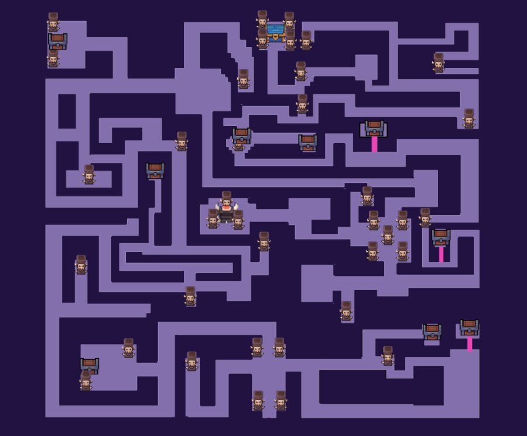

# Maze Explorer

Welcome Ancient Ruins Explorer!

I’ve identified a mysterious chamber deep underground our excavation site. The artifacts held within this chamber would be a considerable addition to the local museum… 
Let's explore the hidden mysteries! This program was written in Python.
Follow along to see how I have written this program using the **Graph**
data structure!

## Getting Started
- Run `git clone {insertRepoNameHere}` to clone this repository.
- Open up PyCharm or your favourite code editor for Python.
- Look for the `main.py` file to run the program.
- You should see a couple of prompt in the CLI. Have fun!

## Technologies
- Python3

